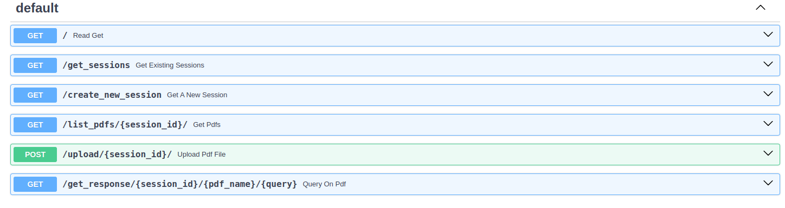

## PDF-Reader-llm
A chatbot to communicate with the pdf

My approach to make a chat-to-pdf with sessions and history chat about the pdf is given.
I will have session creation endpoint, sessions listing endpoints and also inside that session pdf name fetching endpoints.

- A directory "data"
- It contains all the session_id as directory
- Each session_id has pdf-names as subdirectory
- Each pdf-named subdirectory contains pdf file and history.txt which contains the pdf and the concurrent chat with that pdf

for example in this case I have created a session named "session-1". Where WPA2.pdf was uploaded. so, A folder named WPA2 is created where the pdf file and hist.txt is kept.

I have created the endpoints to get existing sessions, create new sessions, upload pdfs and list the pdfs from 
an existing session.

* get_sessions -> get()
gets the list of all the previous sessions

* create_session -> get()
creates a new session and returns the session ID for the current session

* get_pdfs -> get("/list/{session_id}/")
returns the list of pdf files in that particular session

* upload_pdf_file -> post(/upload/{session_id}/)
from this endpoint a pdf file can be uploaded and it saves the pdf file inside that session

* query_on_pdf -> get(/get_response/{session_id}/{pdf_name}/{query})
Extracts the previous conversation from history.txt, gets the contexually similar chunks of texts from the pdf. Then queries the LLM with the query got from the endpoint. It also outputs the time taken for query solving in the terminal.
returns {"response": "response_from_the_LLM"}

To test this I have used streamlit. From streamlit I have created requests to get the session IDs, session pdf files and created a new session.